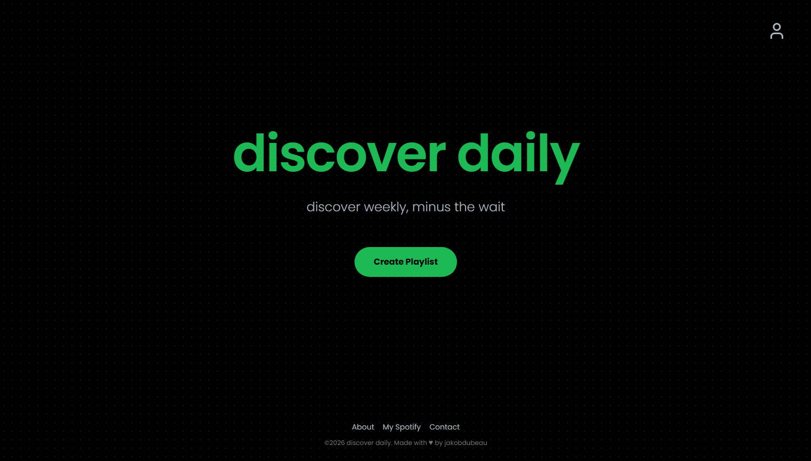
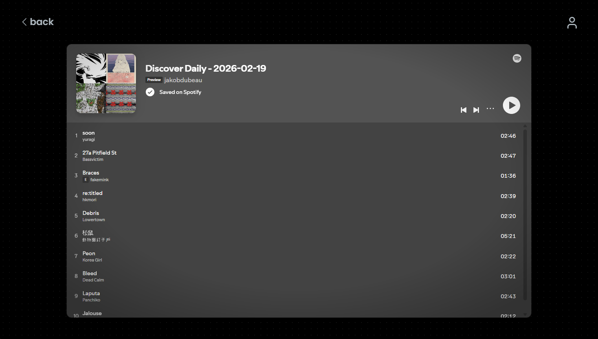

    

<h1 align="center">
    Discover Daily
</h1>
Update - I had to pay $100 for apple music api, so now i pull top artists from spotify, search similar on apple music, then back to spotify to find new stuff. This is my current best option even though it still kinda sucks (I'm good at finding new music so I'd know). I'll be trying to make the recommendations better with my limited options, although it will never be as good as being able to use spotify's recommendations endpoint :(

## Note !
**This project can no longer work as intended due to Spotify's increasingly restrictive API policies.**

> In November 2024, Spotify [removed access](https://developer.spotify.com/blog/2024-11-27-changes-to-the-web-api) to important web API endpoints for development mode apps, this includes recommendations and related artists, which this project heavily relied on.

> Then in February 2026, Spotify [further restricted developer access](https://developer.spotify.com/blog/2026-02-06-update-on-developer-access-and-platform-security) by limiting dev apps to 5 authorized users, introducing unusable rate limits, and reducing available endpoints even further.

These changes make it effectively impossible to build and ship a fully functioning app. Even with the limited endpoints still available, getting approved for real user access requires a minimum of 250,000 monthly active users.

 
 

    Discover Daily is a Spotify playlist generator built to mimic Discover Weekly, making it easy to discover music without waiting a whole week. It connects to Spotify, looks at your top artists and recent plays, then builds a playlist tailored to your taste, mixing songs close to your favourites with some more experimental picks. Every playlist is automatically saved to your library, so you never lose a good find.   Check it out <a href="https://discover-daily-seven.vercel.app" target="_blank">here</a>

## Preview

    

    

## todo:
- auto refresh token
- better playlist filters
- loading animation
- connected spotify indicator
- db integration w/ past generated playlist history (optional login)
- custom playlist embed that looks better
